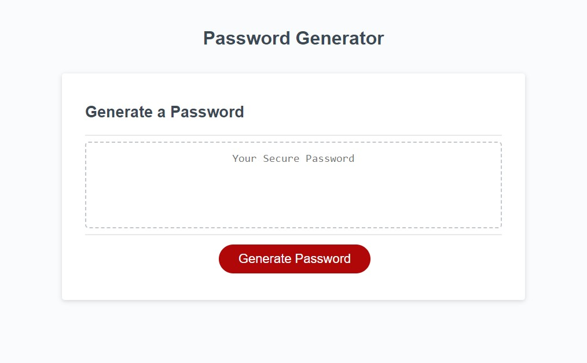

# Random Password Generator

This application generates a random password based on the criteria selected by the user. It is a browser-based application that utilizes HTML, CSS, and JavaScript to dynamically update the UI.

## Getting Started

To use the password generator, simply Click the "Generate Password" button to start the password generation process.

## Usage

The password generator prompts the user to select criteria for their password, including length and character types. The following prompts are presented to the user:

- **Password Length:** select a password length between 8 and 128 characters
- **Lowercase letters:** include lowercase letters in the password
- **Uppercase letters:** include uppercase letters in the password
- **Numbers:** include numbers in the password
- **Special characters:** include special characters in the password

After the user selects their criteria, the application validates the input and generates a password that meets the selected criteria. The password is then displayed on the page.

## Credits

This project was created as a challenge by the UCF coding bootcamp. The application code was written by Luis Robles.

